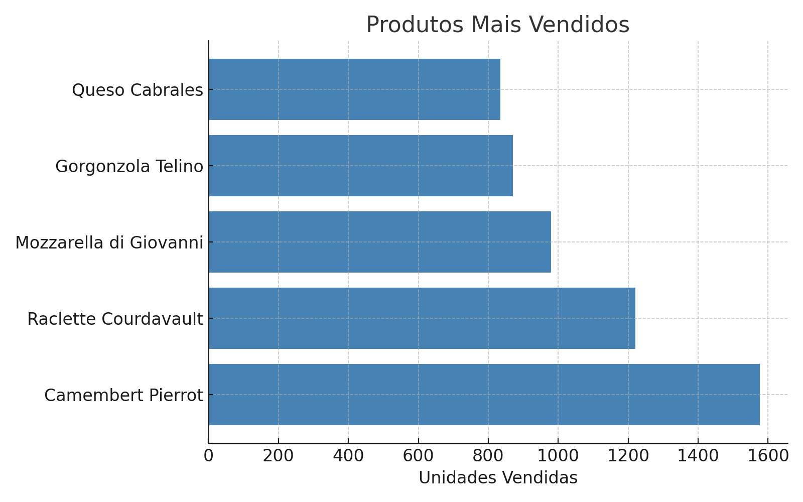
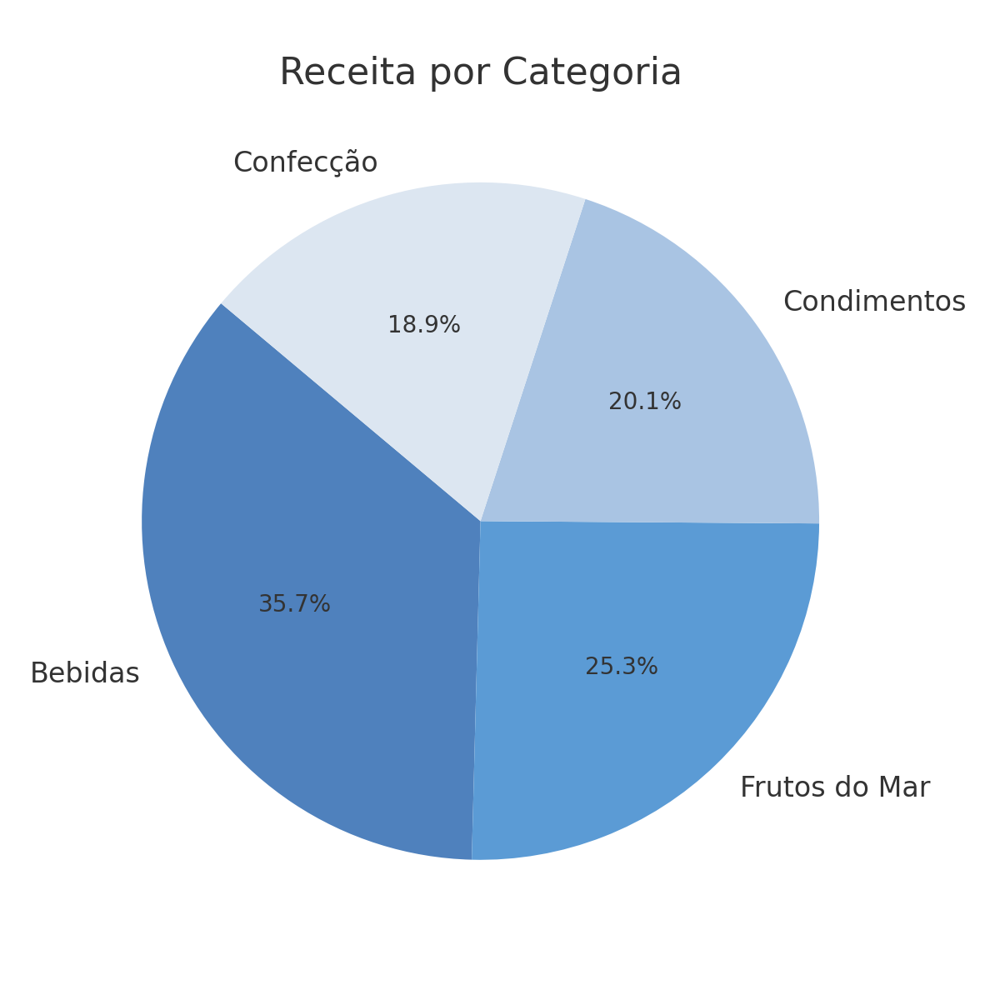
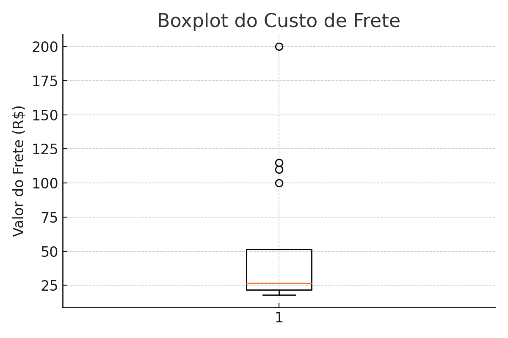
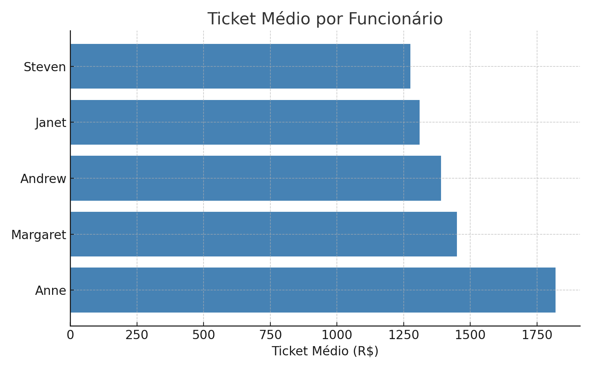

# 📊 Projeto de Business Intelligence - Northwind Traders

> Relatório desenvolvido por **Maria Eduarda Vieira Pereira**  
> 💼 *Analista de Dados | Projeto de BI*

---

## 🧠 Desafio

A Northwind Traders é uma distribuidora de alimentos e bebidas em expansão. O desafio é:
- 📈 Aumentar o **ticket médio dos pedidos**
- 🔄 Reduzir o **churn** (clientes que compram apenas uma vez)

O projeto utiliza técnicas de BI, análise de dados e visualizações interativas para apoiar a tomada de decisões estratégicas.

---

## 🎯 Objetivos do Projeto

- Integrar e tratar diferentes fontes de dados
- Calcular KPIs relevantes (receita, ticket médio, churn, etc.)
- Criar visualizações que gerem insights de negócio
- Propor ações com base nos dados

---

## 🛠️ Ferramentas Utilizadas

- `Python` + `Pandas` para limpeza e análise de dados
- `SQLite` para consultas relacionais
- `Power BI` para dashboards interativos
- `Matplotlib` para gráficos complementares
- `Statsmodels` para projeção de receita

---

## 🔍 Metodologia

## 1. Compreensão do Desafio: Iniciamos com uma análise do cenário atual da Northwind Traders, definindo perguntas de negócio orientadas a dados que ajudassem a alcançar os objetivos propostos.

## 2. Preparação dos Dados: Leitura das Tabelas: Utilizamos o Pandas para importar as 14 tabelas disponíveis.

## 3: Análise Exploratória Inicial: Aplicamos métodos como .head(), .info() e .describe() para entender a estrutura e qualidade dos dados.
- Tratamento de Valores Nulos:
- Textos: Substituídos por "Desconhecido".
- Datas: Preenchidas com pd.NaT ou replicadas de order_date.
- Tabelas Vazias: Descartamos tabelas sem dados relevantes, como customer_demographics.

## 4. Análise Individual das Tabelas: Exploramos cada tabela isoladamente para obter insights preliminares:
- Produtos por Categoria: Identificamos a distribuição dos produtos em suas respectivas categorias.
- Clientes por País: Mapeamos a origem geográfica dos clientes.
- Funcionários por Cargo: Analisamos a distribuição dos cargos na empresa.
- Pedidos por Transportadora: Verificamos a frequência de uso de cada transportadora.
- Boxplot do Frete: Detectamos outliers nos custos de frete.

## 5. Integração dos Dados: Realizamos merges estratégicos para consolidar as informações em um único DataFrame:
- Pedidos e Detalhes dos Pedidos: Unimos orders com order_details para obter a estrutura completa dos pedidos.
- Pedidos e Clientes: Associamos orders com customers para enriquecer com informações dos clientes.
- Pedidos e Funcionários: Vinculamos orders com employees para identificar os responsáveis pelas vendas.
- Pedidos e Transportadoras: Integramos orders com shippers para relacionar as transportadoras.
- Detalhes dos Pedidos, Produtos e Categorias: Combinamos order_details com products e categories para detalhar produtos e suas categorias.
- Produtos e Fornecedores: Unimos products com suppliers para obter informações dos fornecedores.
Essa base consolidada permitiu cruzar dados de vendas, produtos, clientes, logística e equipe comercial de forma eficiente.

## 6. Cálculo de Indicadores Estratégicos (KPIs): Com a base unificada, calculamos os seguintes indicadores:
- Ticket Médio por Pedido: Valor médio das vendas por pedido.
- Produtos Mais Vendidos: Identificação dos produtos com maior volume de vendas.
- Receita por Categoria e por Funcionário: Análise da contribuição de cada categoria de produto e desempenho individual dos funcionários.
- Prazo Médio de Entrega: Tempo médio entre o pedido e a entrega.
- Clientes com Apenas 1 Pedido (Churn): Identificação de clientes que realizaram apenas uma compra.
- Total de Pedidos, Receita Total e Clientes Únicos: Métricas gerais de desempenho.

## 7. Visualizações Avançadas: Criamos visualizações para facilitar a interpretação dos dados:
- Gráficos de Barras e Rosca: Para produtos mais vendidos e participação de categorias na receita.
- Gráficos de Linha: Evolução das vendas ao longo do tempo.
- Boxplots: Análise de custos de frete e identificação de outliers.
- Tabelas e Cartões com Filtros Interativos: Segmentação por país, cidade, categoria e vendedor.

## 8. Modelo de Previsão
Implementamos uma regressão linear utilizando a biblioteca statsmodels para estimar a receita do ano seguinte, baseada em dados históricos. A previsão estimada foi de R$ 654.470,91.

---

## 📈 Gráficos e Indicadores

### Produtos Mais Vendidos

O "Camembert Pierrot" destacou-se em volume de vendas, porém com preço médio baixo.

### Receita por Categoria

Bebidas e frutos do mar geraram maior receita, apesar de menor volume de vendas.

### Boxplot do Frete

A perda de clientes pode estar relacionada à ausência de ações de pós-venda, e não necessariamente à logística.

### Ticket Médio por Funcionário

Funcionários como Anne Dodsworth apresentaram ticket médio alto, mas venderam menos unidades.

### Projeção de Receita

---

## 📌 Resultados e Projeções

- 💰 **Receita Total:** R$ 1.265.793,04  
- 🎯 **Ticket Médio:** R$ 1.525,05  
- 📦 **Pedidos Totais:** 830  
- 🧑‍🤝‍🧑 **Clientes Únicos:** 89  
- ⏱️ **Prazo Médio de Entrega:** 8,35 dias  
- 📊 **Receita Estimada para o próximo ano:** R$ 654.470,91

---

## 💡 Soluções Estratégicas

- Kits Promocionais: Desenvolver pacotes combinando produtos de maior valor para aumentar o ticket médio.
- Benchmarking Interno: Replicar as boas práticas de funcionários com desempenho diferenciado para toda a equipe.
- Campanhas de Reativação: Implementar estratégias para engajar clientes inativos, incentivando novas compras.
- Parcerias Locais: Expandir a rede de fornecedores locais em países com alto índice de churn para melhorar a logística e satisfação do cliente.
- Automação do Pós-Venda: Implementar sistemas automatizados de follow-up, como e-mails personalizados, cupons de desconto e recomendações de produtos.

---

## ✅ Conclusão

A análise detalhada dos dados da Northwind Traders proporcionou insights valiosos sobre o comportamento dos clientes, desempenho da equipe e oportunidades de crescimento. Este projeto exemplifica como uma abordagem orientada a dados pode transformar informações em ações estratégicas concretas, consolidando a empresa como uma organização data-driven.

---

## 🌐 Portfólio

🔗 [Acesse meu portfólio completo aqui](https://eduardavieiraper.github.io/mariaeduardav-portfolio/)
