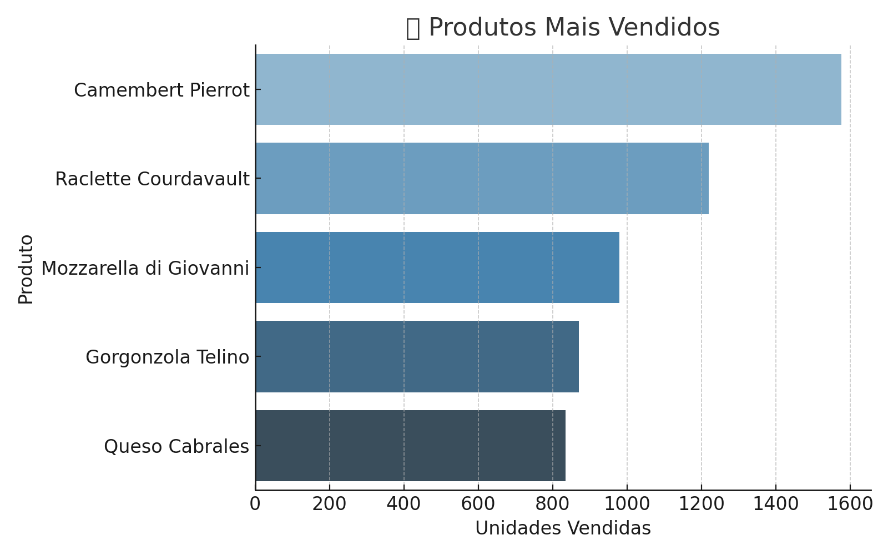
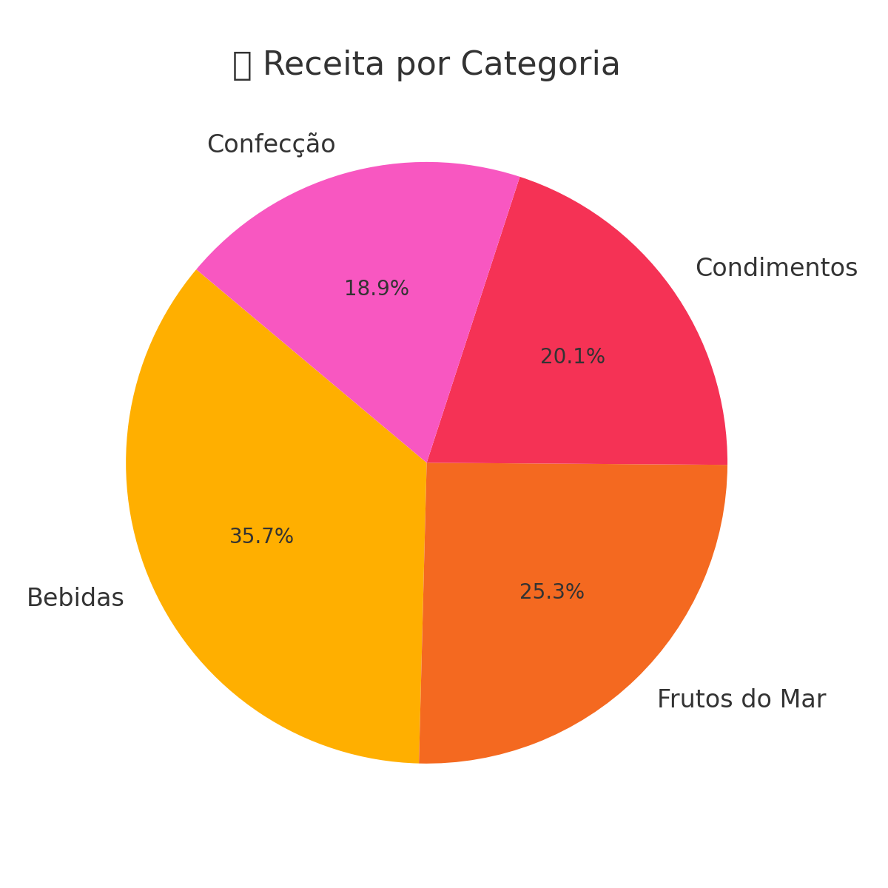
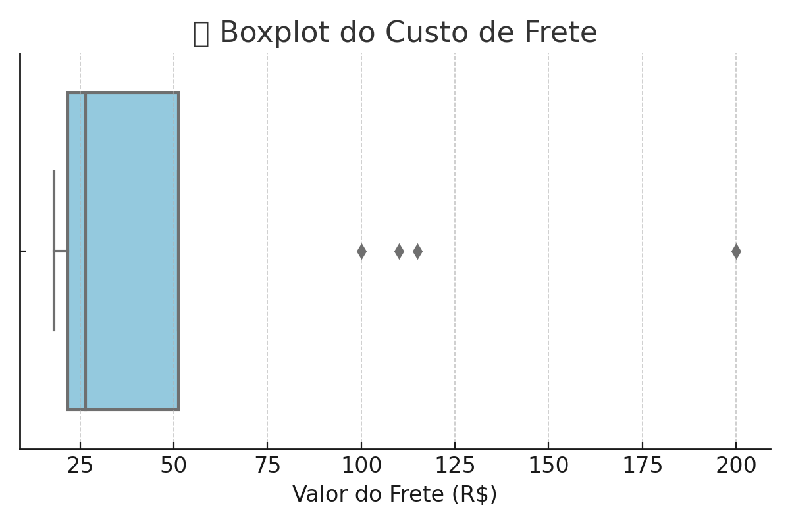
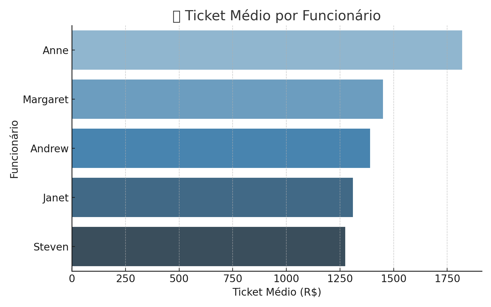
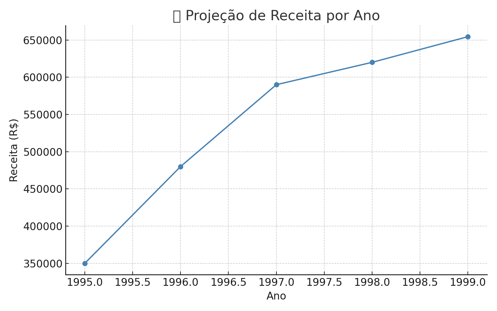

# 📊 Projeto de Business Intelligence - Northwind Traders

> Relatório desenvolvido por **Maria Eduarda Vieira Pereira**  
> 💼 *Analista de Dados | Projeto de BI*

---

## 🧠 Desafio

A Northwind Traders é uma distribuidora de alimentos e bebidas em expansão. O desafio era:
- 📈 Aumentar o **ticket médio dos pedidos**
- 🔄 Reduzir o **churn** (clientes que compram apenas uma vez)

O projeto utiliza técnicas de BI, análise de dados e visualizações interativas para apoiar a tomada de decisões estratégicas.

---

## 🎯 Objetivos do Projeto

- Integrar e tratar diferentes fontes de dados
- Calcular KPIs relevantes (receita, ticket médio, churn, etc.)
- Criar visualizações que gerem insights de negócio
- Propor ações com base nos dados

---

## 🛠️ Ferramentas Utilizadas

- `Python` + `Pandas` para limpeza e análise de dados
- `SQLite` para consultas relacionais
- `Power BI` para dashboards interativos
- `Matplotlib` para gráficos complementares
- `Statsmodels` para projeção de receita

---

## 🔍 Metodologia

1. **Entendimento do desafio**
2. **Exploração e preparação dos dados**
3. **Integração das tabelas com merges**
4. **Criação dos indicadores estratégicos (KPIs)**
5. **Visualizações no Power BI e Matplotlib**
6. **Modelo preditivo de receita**

---

## 📈 Gráficos e Indicadores

### Produtos Mais Vendidos

### Receita por Categoria

### Boxplot do Frete

### Ticket Médio por Funcionário

### Projeção de Receita

---

## 📌 Resultados

- 💰 **Receita Total:** R$ 1.265.793,04  
- 🎯 **Ticket Médio:** R$ 1.525,05  
- 📦 **Pedidos Totais:** 830  
- 🧑‍🤝‍🧑 **Clientes Únicos:** 89  
- ⏱️ **Prazo Médio de Entrega:** 8,35 dias  
- 📊 **Receita Estimada para o próximo ano:** R$ 654.470,91

---

## 💡 Soluções Estratégicas

- Criação de kits promocionais com produtos de maior valor
- Reforço nas boas práticas dos vendedores com ticket alto
- Campanhas de reativação de clientes inativos
- Expansão de fornecedores em regiões estratégicas
- Ações automatizadas de pós-venda

---

## ✅ Conclusão

Este projeto demonstrou como uma cultura orientada a dados (data-driven) pode transformar análises em decisões práticas. A Northwind, com apoio de BI, está mais preparada para crescer com eficiência, fidelizar clientes e aumentar sua rentabilidade.

---

## 🌐 Portfólio

🔗 [Acesse meu portfólio completo aqui](https://eduardavieiraper.github.io/mariaeduardav-portfolio/)
